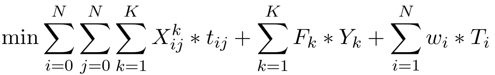

# Integrated Machine Scheduling and Heterogeneous Fleet Vehicle Routing Problem :calendar::truck:
This problem consists in scheduling _N_ jobs inside a linear machine with _K_ available vehicles composing a Heterogeneous Fleet. This is a new variation of the Integrated Problem in literature, which has vehicles with **different capacities** and jobs with **different sizes** simultaneosly. The main objective of this problem is to minimize the total delivery time, total vehicle use costs and total tardiness weight.

Each job _i_ has the following atributes:

- _Pi_ → Processing Time
- _wi_ → Penalty weight
- _di_ → Due date
- _si_ → Size

In a similar way, each vehicle _k_ has the following atributes:

- _Fk_ → Cost
- _Qk_ → Capacity

The problem's objective function is defined as follows, being composed by three parts:

(1) Minimize total delivery time, (2) Minimize vehicle use costs and (3) Minimize total tardiness weight.

## Metaheuristics :pencil:

The *main* metaheuristics developed for this problem were two _Iterated Local Search (ILS)_ and one _Genetic Algorithm_.

Find more information at _Code folder_.

## MILP Model _CPLEX Concert_ :pencil:

A mixed-integer linear programming model was developed to solve the given problem for small instances and generate insight for small instances. By doing this it is possible to find optimal solutions and then compare with new metaheuristics.

The model was implemented in C++ using the CPLEX Concert library, find more at _CPLEX Model folder_.

## Results :bar_chart:
(continue)

